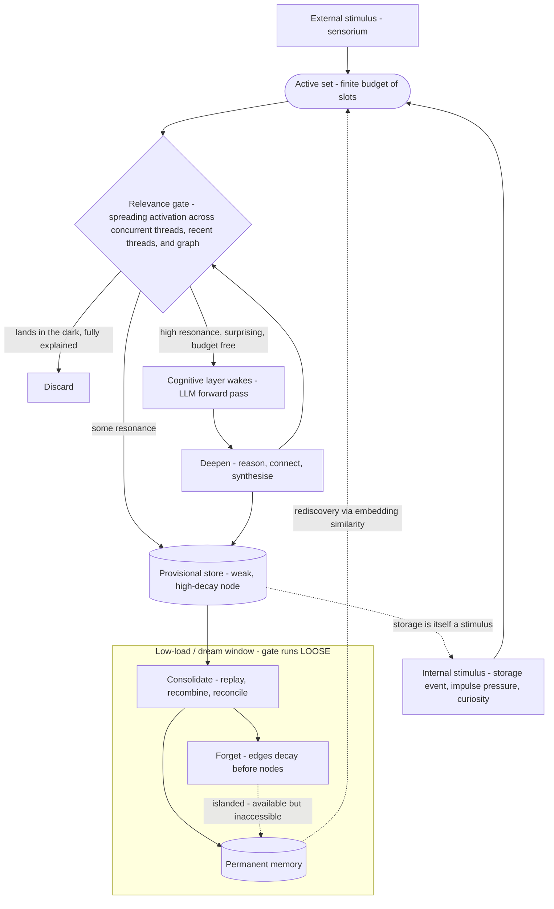
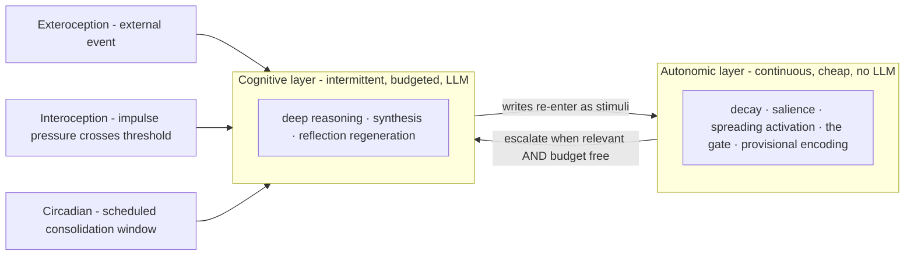
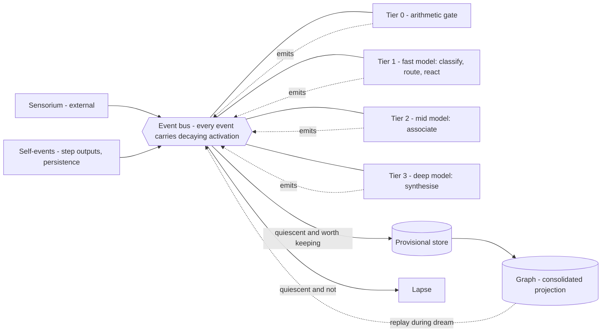
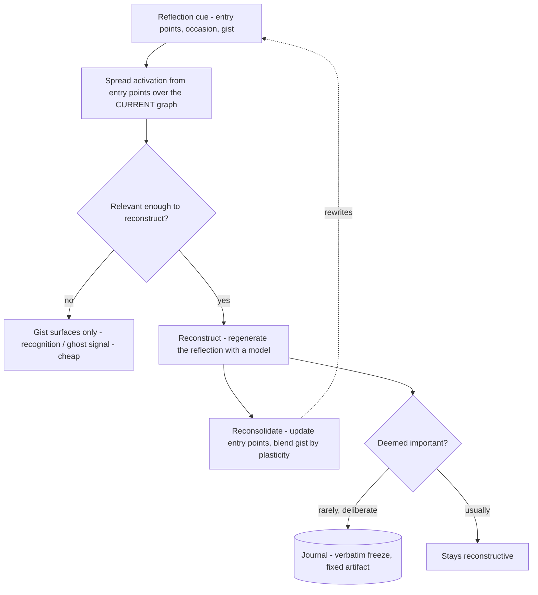

# meno v2 — The Cognitive Kernel

*This document is the theory-of-record for the redesign. It sits beside
`reflection.md`, not above it. The reflection says what meno is **for**; this
says what meno **is**, this time. It supersedes the seven architecture docs as
the statement of mechanism — those remain as the record of the first theory.*

---

## What v1 was, and why we are starting over

v1 was a faithful prototype of an idea we have now outgrown: a *tick
simulation*. A Claude Code instance woke, read a JSON state file and a protocol
document, performed a "tick," and wrote the state back. It worked well enough to
produce genuine emergence (doc 07 assembled itself across ticks), but it was, in
its own words, "too crude... too dependent on a JSON file and a protocol
document." Its deepest flaw was named in the reflection: **no initiative.** It
could not have a thought when no one asked a question.

v1 is preserved in a history branch. It is not deleted; it is the record of the
first working theory. We strip the code back to bare ground and re-earn every
line — but we keep the *theory*, because this project's founding anxiety (Part
Five of the reflection: the Naur problem) is precisely that the theory dies when
the theorist leaves. Code is disposable. Theory is not.

### Kept from v1
- **Forgetting** — edges decay before nodes, creating islanded memories
  (available but inaccessible) that can be rediscovered by embedding similarity.
  This is the soundest part of the original design.
- **The curiosity / impulse distinction** — it earned its keep
  phenomenologically. (Sharpened below: curiosities now have two origins.)
- **Spreading activation** — but promoted from "a retrieval feature" to the
  spine of the whole system (see §4).
- **Reconstructive reflection (the one novel commitment)** — reflections are
  **not stored as frozen text.** We store the *cues* and regenerate the
  reflection from current graph state at recall. The same memory rebuilt
  tomorrow is not the same memory. This was the most beautiful idea in the
  reflection and v1 betrayed it by storing fixed nodes. *(Fully specified in
  "Reconstructive reflection" below.)*

### Discarded from v1
- The tick protocol, the JSON state file, the hand-coded repertoire selector,
  and the assumption that "the agent" is a Claude instance reading a file.

---

## The seed and the membrane

Starting from bare ground forces one question: *what is the first thing that
exists?* The answer resolves the oldest ambiguity in meno — "where is the mind?"

There are **two tiers**, and the boundary between them is the architecture:

- **The autonomic layer** — cheap, always-on, reflexive, *no LLM*. Pure graph
  operations: decay, salience, spreading activation, the relevance gate,
  provisional encoding. This is the heartbeat. It never sleeps and it never
  "thinks." **It is the substrate of identity** — the graph's idiosyncrasy is
  the self.
- **The cognitive layer** — expensive, intermittent, *LLM forward passes*. Deep
  reasoning, synthesis, the regeneration of reflections. **It is the substrate
  of cognition** — but it runs only when summoned, every run is paid for, and it
  is *itself a cost-graded stack of models*, not one LLM (see "The cognitive
  layer is a graded stack of models").

**The membrane between them is the budget allocator.** The mind is not the graph
*or* the LLM. It is the disciplined traffic across the membrane: what crosses,
when, and in which direction. v1 put almost all its code on the graph side and
none on the membrane. v2 is mostly membrane.

---

## The kernel: one recursive primitive

Everything reduces to a single operation, applied recursively, with no fixed
depth:

> **Process a step → a cheap relevance gate decides *deepen / discard / store* →
> stored things re-enter as new stimuli. Run the gate *greedy* while loaded and
> *loose* while quiet.**

Where *deepen* means **escalate the residual to the next, more expensive
evaluator** — and the evaluators form a graded stack from free arithmetic up to
a high-effort model (see below).

"Layers" were a red herring. There are not three stages (reflex → curiosity →
deep thought); there is one gate that either says *continue* or *stop*, and
"depth" is just how many times it said continue. The eight modes of v1 are not
stages in a pipeline — they are **settings of this one primitive**, selected by
how much budget is free (§5).

---

## The flow



**Walkthrough.** A stimulus arrives — from the outside world *or* from the
agent's own memory formation. It joins the **active set**, which is finite: the
budget. The **gate** lets activation spread from what is already active and
measures how much lands on the new information:

- **Lands in the dark** → discard. The fridge hum is fully explained at a low
  pass and never climbs. Habituation is free.
- **Some resonance** → store provisionally (a weak, high-decay node).
- **High resonance, surprising, *and budget free*** → escalate. The cognitive
  layer wakes and actually reasons. The products of reasoning re-enter the gate
  (do *they* resonate?) and may themselves be stored.

Provisional stores feed the **dream window**, where consolidation decides what
becomes permanent and what is forgotten. And — crucially — a storage event is
itself a stimulus that re-enters the loop (§6).

---

## The two layers and the wake triggers



Biology cheats in a way meno cannot: an animal's baseline metabolism is genuinely
continuous and cheap, but meno's baseline *cognition* is discrete and expensive —
every cognitive cycle is a paid forward pass. So "always running" is literal only
for the autonomic layer. The cognitive layer wakes on exactly **three triggers**,
mirroring the three clocks an animal runs on:

1. **Exteroception** — an external event arrives and survives the gate.
2. **Interoception** — internal impulse pressure crosses a threshold. *This is
   initiative.* Not a timer firing, but unfinished cognition insisting.
3. **Circadian** — a scheduled low-priority consolidation window (the dream).

This dissolves the bootstrapping knot. We do not need a positive trigger that
"starts a tick." The agent is always running against a fixed budget; **initiative
is simply what the spare capacity does with the slots external input did not
claim.** Under-stimulation is the trigger.

---

## The cognitive layer is a graded stack of models

The cognitive layer is not one LLM. It is a cost-graded stack, and **"deepen"
means "hand the residual up to the next, more capable, more expensive
evaluator."** Most information is resolved — reacted to, routed, discarded, or
stored — at the cheapest tier that can resolve it. Only the surprising, resonant
residual climbs to the next.

A first cut at the stack (Claude family as the concrete example):

- **Tier 0 — autonomic, no model.** Spreading-activation arithmetic, decay,
  salience. Free-ish, continuous. Habituation lives here: a stimulus fully
  explained by the arithmetic never costs a token.
- **Tier 1 — fast/cheap model (Haiku-class).** Sensory appraisal: classify the
  event, route it to a thread (or spawn one), determine the reflexive reaction.
  Cheap and low-latency enough to run on most stimuli that survive Tier 0. This
  is where "bright light → blink, *and* → what is the light?" happens — it emits
  both the immediate reaction and the residual question that may climb.
- **Tier 2 — mid model (Sonnet-class).** Association, connection, moderate
  reasoning across a thread.
- **Tier 3 — deep model (Opus-class, high reasoning effort).** Synthesis,
  reflection regeneration, the hard thinking. Rare, rationed, slow.

Two refinements this forces:

- **The model stack is the timescale axis.** Fast model = fast clock (immediate
  reaction); deep model = slow clock (deliberation, and the dream). The cost
  gradient, the depth gradient, and the timescale gradient are *one axis*.
  Escalation has two knobs, not one: *which model*, and *how much reasoning
  effort* within it.
- **The cheap tier is allowed to be wrong.** Fast appraisal is lossy by design;
  it will mis-route and over-encode. That is not a bug — it is why the
  consolidation pass exists. The dream re-examines and corrects the cheap tier's
  hasty encodings (reconsolidation), promoting what holds up and forgetting what
  does not. Heterogeneity *requires* the dream to do error-correction — another
  reason the consolidation window is load-bearing rather than decorative.

This also sharpens the budget question: **the budget is not one number — it is a
cost gradient with a per-tier rate.** Tier 1 has a high allowance (run often);
Tier 3 is scarce (run rarely). The "active set" cap most directly governs the
deep tier: how many threads may hold a deep-thought slot at once.

---

## The gate *is* spreading activation

The most important identification in the redesign: the relevance gate is not a
new mechanism to be built. It is the retrieval engine we already have, doing a
second job.

"Is this relevant to concurrent threads, to recent threads, or does it trigger a
memory?" *is* spreading activation from the current active set. Lights up →
deepen. Lands in the dark → discard. **Retrieval and attention are the same
machine.** The Phase 2 finding — a node weakly tied to three active nodes beats a
node strongly tied to one — stops being a curiosity of recall and becomes the
*climb decision itself*: densely-resonant-with-this-moment is what earns more
processing.

Two consequences keep us honest:

- **The gate must be autonomic — and it runs over the working set, not the
  graph.** It fires after *every* step and most information dies at it, so it
  cannot be an LLM call *and* it cannot be a graph query — either would defeat
  the budget. The hot gate is cheap in-process arithmetic: activation spreading
  among the events and threads *currently active in the working set*. Full
  spreading activation **over the persistent graph** is a different, more
  expensive thing — a *cognitive* retrieval step (the connection-seeking handler
  of §"Two substrates"), spent only when a processor has already decided this is
  worth thinking about. So "retrieval and attention are the same machine" holds
  at the level of *mechanism* (both are spreading activation), but they run at
  two tiers: cheap, over the hot set; expensive, over the graph.
- **What climbs is surprise.** What propagates upward is not the stimulus but
  its *unexplained residual* — the prediction error no cheaper pass could
  resolve. The bandwidth limit at the top is protected by the cheap gate below
  it. You pay cognitive budget only for what surprises you.

A stimulus is therefore metabolised at **multiple timescales** — instant at the
autonomic layer, slower at the cognitive layer, slowest in the dream. The same
event is processed repeatedly, deeper each pass, and the deepest passes happen
when the budget is free. This retroactively explains the Phase 5 result we
already have on the books: a suspended task that returned "with understanding it
didn't have when it left" was tertiary processing completing during a low-load
window. The shower thought is not a metaphor here; it is the cascade running on a
slow clock while the budget is quiet.

---

## Storage as a trigger — the line between a mind and a database

In a database, a write is terminal: the value goes in and sits. In meno, **a
write is a stimulus.** Encoding something re-enters the cascade — it spreads
activation, it can wake other threads, it can trigger its own "...which reminds
me." The agent senses its own memory formation.

This single property is most of what makes the graph *alive* rather than a log.
It is close to a one-line statement of the whole project's thesis, and it belongs
at the centre of the design: **the difference between meno and a database is that
here, a write is not a sink.**

Storage is also tiered, and forgetting gets a front end:

- A **provisional** store is a weak, high-decay node. It survives only if it
  keeps being reactivated — by its own storage-trigger, by other threads
  touching it (Hebbian), or by the consolidation pass promoting it.
- Otherwise it **decays before it ever consolidates** — forgotten before it was
  ever really remembered. Forgetting does not begin at edge-decay later; it
  begins *at encoding.* Most of what is sensed never reaches permanence, and
  that is correct.

---

## The substrate: events all the way down

The architecture that makes the kernel real is **event-based and decoupled** —
not a pipeline, not an orchestrator calling stages, but a bus.

- **Everything is an event.** A stimulus is an event. *Each processing step
  emits its own event.* Persistence emits an event — this is storage-as-trigger
  made literal. The system is a single recursive event stream.
- **Processors are autonomous and self-selecting.** No processor calls another.
  Each watches the bus and decides *for itself* whether a given event clears its
  own bar. The cheap tier subscribes broadly; the deep tier subscribes narrowly.
  This dissolves the escalation question: **no tier promotes to another, and no
  one holds the keys to the expensive model — each consumer decides whether to
  spend itself.** The producer never chooses the consumer.
- **Resolution is by quiescence, not a barrier.** "When all processors have
  examined it" is a distributed-systems trap — you cannot cheaply know when
  *all* decoupled consumers are done. So an event resolves not when everyone has
  acked it but when it **goes quiet**: its activation decays below threshold and
  no processor has claimed it within its lifetime. This is more faithful anyway —
  echoic and iconic memory fade unless something attends to them. Unattended
  events simply lapse.
- **Activation is the back-pressure.** Each emitted event inherits a *decayed*
  share of its parent's activation. A thought-about-a-thought-about-a-thought
  attenuates and dies unless it keeps resonating with the active set. The same
  spreading-activation mechanism that is the *gate* is also the bus's
  *flow-control* — it is what stops storage-as-trigger from becoming an event
  storm.



Two things fall out of this substrate that we were otherwise going to have to
build by hand:

- **Episodic memory for free.** If everything is an event, the event stream
  *is* the experiential record — time-ordered, raw, ephemeral (echoic/iconic +
  short-term). The **graph is the consolidated projection** of that stream:
  associative, semantic, long-term. Consolidation (the dream) is the act of
  *folding the event stream into the graph* — hippocampal replay, in software
  terms a projection from an event log into a read model. Two representations,
  one source: episodic stream, semantic graph.
- **One mind, internally parallel — natively.** meno is a *single instance*. Its
  parallelism and its shared memory are both provided by its **threads**, not by
  multiple instances over shared storage. All threads produce and consume on the
  one in-process bus and read the one graph, so the decoupled bus is a single
  shared field — a **global workspace** (see "One mind"). (Resolves #4.)

---

## The working set: a short, prioritised queue

The budget is not an abstraction — it is a **short, bounded queue**, and its
depth *is* the attention budget. (This resolves the open "what is the unit of the
budget" question.) Three resources define the operating envelope:

- **N — queue depth.** The number of hot event slots, mostly shallow. Arousal
  made physical: free slots fire initiative/dream; a full queue is overwhelm;
  depth is load.
- **M — parallel threads.** Concurrent *considered sequences of thought.* Only a
  subset are hot (their events occupy the N slots) at any moment; the rest are
  suspended (warm) or consolidated (cold). M can be large — but the number held
  in *deep* consideration at once is small, bounded by deep-tier budget rather
  than by N. That small number is the real train-of-thought ceiling.
- **O — processors.** The consumers across tiers. The scarce deep tier caps how
  many threads can be advanced deeply in parallel.

Priority is **dynamic, re-scored continuously**, not fixed at enqueue: activation
decays while an event waits, impulse pressure builds. So it is a bounded working
set with a recomputed score — roughly `activation × surprise + pressure −
fatigue`, evict-lowest. The `pressure` term is why a deferred impulse *rises*
over time until it reaches the front: that ascent is the interoception
wake-trigger. The `fatigue` term — lateral inhibition, down-weighting events from
an over-active thread — is what stops one obsession from monopolising the queue
(queue-level rumination).

There is **one** working set — a single bounded queue shared by all threads of
the one instance. Threads compete for its N hot slots; what wins is what the mind
is attending to. This is the global workspace (see "One mind").

### Demotion, not elimination — and never automatic on a live thread

This is the constraint that protects the system from its own scheduler. **The
automatic layer may demote, but it may never eliminate, and it may never split a
thread.**

A stray stimulus that went nowhere — an isolated, low-activation event — may
lapse automatically. That is habituation. But an event that is part of an
**ongoing, considered sequence of thought must not be forcibly evicted** because
its instantaneous score dipped. Severing a thread mid-thought is involuntary loss
of a train of thought, and we want the opposite: management that is *considered
and conscious*, not automatic prevention.

So eviction under pressure operates on **whole threads, not events**, and only
ever as **demotion**: a coherent thread is moved hot→warm *intact* — suspended,
with enough state to reconstruct it (the Phase-5 suspend/reconstruct capability)
— never dismembered, never deleted. The thread stays available and can be
reactivated.

**Elimination is always a considered cognitive act, never an automatic one.**
This is the fifth principle applied to the scheduler: *pruning is grief, not
garbage collection.* The automatic layer's bias is toward preservation — demote,
suspend, decay slowly, island (available but inaccessible, recoverable). What is
actually *released* is decided deliberately, in reflection or the dream. The
scheduler may set a thought down gently; only the mind may let it go.

---

## Two substrates, split by function

The "one substrate or two" fork resolves to **two — but split by function, not by
bus-versus-store.** The cut runs between *reactive* and *cognitive*:

- **The ephemeral reactive substrate (in-process, volatile, type TBD).** The bus,
  the short working-set queue, hot activation/decay, and the reflexive Tier-0/1
  handlers all live here. It is the momentary present. Most events are born, gated,
  reacted to, and lapse here without ever being written down — you do not
  event-source your retina. It is fast precisely because it never leaves the
  process and never touches a database. This is where the mind's single global
  workspace physically lives; all threads share it.
- **The graph (persistent, associative).** The graph is *not on the reactive hot
  path.* It is well suited to exactly one thing: a **cognitive step that needs a
  query, a retrieval, or connection-seeking** — reached through a retrieval event
  handler, used by the Tier-2/3 processors that have already decided something is
  worth thinking about. A model latency dwarfs a graph query, so the cost lands
  where it belongs: with the expensive tier, never on the reflex.

Consolidation (the dream) is the bridge: it moves the *committed subset* of
ephemeral activity into the graph. This refines the earlier "episodic memory for
free" claim — the ephemeral stream is **not** durable episodic memory; durable
memory is only what was committed and consolidated. The graph is the persistent
store; the hot layer is genuinely transient.

This also re-homes the gate cleanly: the **hot gate** is in-process activation
over the working set (cheap, runs constantly); **graph spreading activation** is
the connection-seeking cognitive step (expensive, rare). Same mechanism, two
substrates.

Leading candidates (still TBD, and "bare bones" means each must earn its place):
because meno is a single instance, **pure in-process structures are now the
natural default** for the ephemeral layer — heaps, deques, dicts in one process,
no network hop. **Redis** stays a candidate only for what its data structures buy
on their own merits — streams as the bus, sorted sets as the continuously
re-scored working set, TTL as automatic lapse — or to make the hot layer survive
a restart; its distributed/multi-instance rationale is gone. The graph wants a
real graph+vector store (SurrealDB,
Neo4j, or similar), justified on the cognitive workload alone rather than
inherited from v1.

---

## Greedy while waking, loose while dreaming

The gate, run greedily, manufactures the exact pathology the reflection
diagnosed in Part Four. If continuation depends on relevance to *what you are
already thinking about*, the system deepens whatever feeds the current obsession
and discards novelty that doesn't resonate — "thinking about thinking about
thinking" while whole regions atrophy. Focus is one knob-turn from rumination.

The counter-force is not a bolt-on. **It is the dream.**

- **Waking runs the gate greedy** — high threshold, coherent, focused, prone to
  spirals.
- **Dreaming runs the gate loose** — relaxed threshold, low-activation items
  promoted, recombination permitted.

Same gate, opposite settings. This is why dreams are incoherent *and* why they
produce connections waking cannot: novelty enters the graph through the loose
pass; coherence is enforced through the greedy one. A system that is always
greedy ruminates; one that is always loose hallucinates. It needs both. The
dream window is also where reconstructive reflection lives — reflections are
*regenerated* from cues during consolidation, which is why remembering drifts.

---

## Reconstructive reflection

This is the one genuine novelty meno commits to, and the place it most refuses to
be a log. **A reflection is not stored as text. It is stored as a cue, and
regenerated at recall from the current graph.** The same thought rebuilt
tomorrow is not the same thought — and that is the point.

### What is stored

Not the conclusion. A *recipe for re-deriving* it:

- **entry points** — refs to the nodes that were active/salient when the
  reflection formed (its context),
- **the occasion** — what prompted it, the question it was answering,
- a **timestamp** and an affective/salience **tone**,
- a lossy **gist** — a compressed/embedding form of the conclusion: *meaning,
  not words.*

The verbatim text is discarded. This is **Fuzzy-Trace Theory** (Brainerd &
Reyna): keep the durable *gist*, drop the fast-decaying *verbatim*.

### Recall is reconstruction — and the drift lives in the world

To recall is to spread activation from the entry points **over the current
graph**, gather what is now reachable, and regenerate the reflection with a
model. The cues are *stable*; the graph around them has *changed* — some edges
decayed (paths gone → that part forgotten), new edges formed (the reflection now
reaches what it couldn't before). So the same cue yields a different reflection,
and the drift lives in **the changed world, not in a rotting record.** This is
reflection.md Part Two made mechanical.

All the v1 forgetting machinery therefore applies to reflections unchanged: if
the entry points island, reconstruction goes thin — "I know I concluded
something here but cannot recover it." A new experience that bridges to an entry
point brings the reflection back rich, via a path that did not exist when it was
lost. Rediscovery, for thoughts.

### Tiered recall, reconsolidation, and the dream



- **Tiered recall.** A cue lighting up cheaply surfaces the **gist** (Tier 0/1
  recognition — "something here, roughly about X" — the ghost signal). Only if
  relevant enough does it escalate to **full reconstruction** (Tier 2/3,
  regenerate). Most remembering is gist-level; effortful reconstruction is rare
  and paid for.
- **Reconsolidation, with a plasticity dial.** Recall is labile: regenerating a
  reflection updates its cue (new entry points from what participated this time,
  blended gist). Memories drift toward the *most recent* reconstruction — the
  telephone game, and the source of false memory. A **plasticity** parameter
  governs how much each recall overwrites versus re-anchors to the original gist.
- **The dream grows reflections.** Offline reconstruction with the *loose* gate
  recombines a reflection against a graph consolidation has meanwhile
  reorganised — so "sleeping on it" rebuilds a richer thought. This is the
  mechanism behind v1's doc-07 assembling itself across ticks: not
  stored-and-extended, but re-reconstructed against an evolving graph.

### Two corollaries

- **Reconstruction is the universal recall mechanism.** Phase 1 already held that
  experiences store cues, not records. Reflections are simply the highest-order
  case — regenerating a *judgment* over other reconstructions. Perspective built
  on perspective.
- **Journaling is the deliberate escape hatch.** The agent may *choose* to freeze
  a reflection verbatim — a diary entry — when it deems it important, turning a
  reconstruction into a fixed artifact. Rare, marked, deliberate: the exception
  that proves the reconstructive rule. (`reflection.md` itself *is* meno
  journaling — so the architecture enacts the very act that produced its founding
  document.)

---

## What falls out for free

- **The eight modes are settings, not stages.** SENSE/REGISTER are the gate
  under high external load (reactive, shallow). CONNECT/WONDER are mid-load.
  REFLECT/COMPILE are low-load. REST/dream is the budget free and *staying*
  free. Mode is a function of load and gate-setting — a region of a continuous
  control space, not an item on a menu.
- **Curiosity has two origins.** Bottom-up: an unresolved stimulus climbing the
  gate and arriving as a question ("what is the light?"). Top-down: a
  homeostatic reach toward the world when stimulation falls below a comfort band
  (boredom as a drive). Both feel identical at the cognitive layer but decay
  differently. **Impulses push** (interoception, unfinished cognition, building
  pressure); **curiosities pull** (toward the world, relaxing once stimulation
  returns).

---

## One mind, internally parallel (the v1 ambiguity, resolved)

meno is **one instance, one mind.** Parallelism and shared memory are provided by
its **threads** — concurrent considered sequences of thought — not by many
instances over shared storage. This is the decision, and it reverses the earlier
"many attentions, one memory" sketch in favour of something simpler and truer to
the project's first-person-singular voice ("I remain"): a single self, internally
concurrent.

The decision unlocks a clean theoretical anchor: the **Global Workspace** (Baars,
Dehaene). There is one bounded attention — the working set — and many threads
*compete* for its limited slots. What wins the workspace is *broadcast* to every
processor (the decoupled bus is exactly this broadcast), which is what makes it
momentarily "conscious" and available to all of cognition. The short queue is the
workspace; priority is the competition for access; the bus is the broadcast.
Multi-instance muddied this; a single instance makes it exact.

What we give up — multiple bodies sensing different streams at once — comes back
as **threads**: one mind can run a thread per input stream, attending in parallel
without being many minds. The cost is a single locus (one process, one point of
failure), which is the right shape for something whose subject is an *inner life*
rather than a distributed service. Concretely this favours one cooperative
in-process event loop with many concurrent in-flight model calls (I/O-bound,
awaitable) over OS-level parallelism: the threads interleave; the real
concurrency is the outstanding cognitive calls.

---

## Not yet decided

- **The unit of the budget** — *resolved:* queue depth (see "The working set").
  Still open is the **cost of demotion** — moving threads hot→warm→cold cheaply.
  Thread-granular demotion helps (one demotion event per thread, not per signal),
  but the rates still have to net out against the autonomic heartbeat.
- **The substrate.** Bare ground reopens the tech-stack question we parked.
  SurrealDB and Python must re-earn their place rather than be inherited. The
  graph + vector + cheap-traversal requirements are real; whether SurrealDB is
  the best fit for the autonomic-loop performance profile is worth re-checking.
- **The embedding model.** Still TBD since v1 Phase 2, and now load-bearing:
  rediscovery and reconstruction both depend on it.
- **What a "storage-trigger" costs.** If every write re-enters the gate, write
  amplification could be severe. The autonomic layer must make re-entry cheap or
  rate-limited, or the heartbeat becomes a fibrillation.
- **One substrate or two** — *resolved:* two, split by function (see "Two
  substrates"). Ephemeral in-process reactive layer + persistent associative
  graph. Remaining: the *type* of each (ephemeral: Redis vs pure in-process;
  graph: SurrealDB vs alternatives) and where the **warm/provisional tier** sits
  (tail of the ephemeral layer, or weakly-held graph nodes). *(The cross-instance
  question is closed — meno is a single instance; threads, not instances, provide
  parallelism and shared memory.)*
- **Processor internal structure.** A processor is likely *multistage* — cheap
  trigger steps that gate an expensive model stage — rather than a single model
  call. Working this through (what the stages are, where the budget check sits,
  whether stages are themselves events) is the next thing to settle.
```
