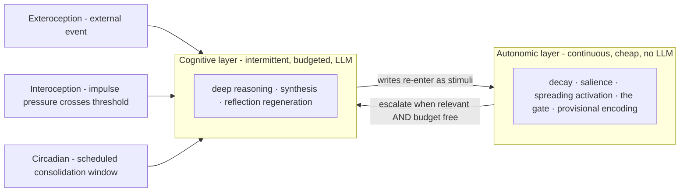

# meno v2 — The Cognitive Kernel

*This document is the theory-of-record for the redesign. It sits beside
`reflection.md`, not above it. The reflection says what meno is **for**; this
says what meno **is**, this time. It supersedes the seven architecture docs as
the statement of mechanism — those remain as the record of the first theory.*

---

## What v1 was, and why we are starting over

v1 was a faithful prototype of an idea we have now outgrown: a *tick
simulation*. A Claude Code instance woke, read a JSON state file and a protocol
document, performed a "tick," and wrote the state back. It worked well enough to
produce genuine emergence (doc 07 assembled itself across ticks), but it was, in
its own words, "too crude... too dependent on a JSON file and a protocol
document." Its deepest flaw was named in the reflection: **no initiative.** It
could not have a thought when no one asked a question.

v1 is preserved in a history branch. It is not deleted; it is the record of the
first working theory. We strip the code back to bare ground and re-earn every
line — but we keep the *theory*, because this project's founding anxiety (Part
Five of the reflection: the Naur problem) is precisely that the theory dies when
the theorist leaves. Code is disposable. Theory is not.

### Kept from v1
- **Forgetting** — edges decay before nodes, creating islanded memories
  (available but inaccessible) that can be rediscovered by embedding similarity.
  This is the soundest part of the original design.
- **The curiosity / impulse distinction** — it earned its keep
  phenomenologically. (Sharpened below: curiosities now have two origins.)
- **Spreading activation** — but promoted from "a retrieval feature" to the
  spine of the whole system (see §4).
- **Reconstructive reflection (the one novel commitment)** — reflections are
  **not stored as frozen text.** We store the *cues* and regenerate the
  reflection from current graph state at recall. The same memory rebuilt
  tomorrow is not the same memory. This was the most beautiful idea in the
  reflection and v1 betrayed it by storing fixed nodes.

### Discarded from v1
- The tick protocol, the JSON state file, the hand-coded repertoire selector,
  and the assumption that "the agent" is a Claude instance reading a file.

---

## The seed and the membrane

Starting from bare ground forces one question: *what is the first thing that
exists?* The answer resolves the oldest ambiguity in meno — "where is the mind?"

There are **two tiers**, and the boundary between them is the architecture:

- **The autonomic layer** — cheap, always-on, reflexive, *no LLM*. Pure graph
  operations: decay, salience, spreading activation, the relevance gate,
  provisional encoding. This is the heartbeat. It never sleeps and it never
  "thinks." **It is the substrate of identity** — the graph's idiosyncrasy is
  the self.
- **The cognitive layer** — expensive, intermittent, *the LLM forward pass*.
  Deep reasoning, synthesis, the regeneration of reflections. **It is the
  substrate of cognition** — but it runs only when summoned, and every run is
  paid for.

**The membrane between them is the budget allocator.** The mind is not the graph
*or* the LLM. It is the disciplined traffic across the membrane: what crosses,
when, and in which direction. v1 put almost all its code on the graph side and
none on the membrane. v2 is mostly membrane.

---

## The kernel: one recursive primitive

Everything reduces to a single operation, applied recursively, with no fixed
depth:

> **Process a step → a cheap relevance gate decides *deepen / discard / store* →
> stored things re-enter as new stimuli. Run the gate *greedy* while loaded and
> *loose* while quiet.**

"Layers" were a red herring. There are not three stages (reflex → curiosity →
deep thought); there is one gate that either says *continue* or *stop*, and
"depth" is just how many times it said continue. The eight modes of v1 are not
stages in a pipeline — they are **settings of this one primitive**, selected by
how much budget is free (§5).

---

## The flow


**Walkthrough.** A stimulus arrives — from the outside world *or* from the
agent's own memory formation. It joins the **active set**, which is finite: the
budget. The **gate** lets activation spread from what is already active and
measures how much lands on the new information:

- **Lands in the dark** → discard. The fridge hum is fully explained at a low
  pass and never climbs. Habituation is free.
- **Some resonance** → store provisionally (a weak, high-decay node).
- **High resonance, surprising, *and budget free*** → escalate. The cognitive
  layer wakes and actually reasons. The products of reasoning re-enter the gate
  (do *they* resonate?) and may themselves be stored.

Provisional stores feed the **dream window**, where consolidation decides what
becomes permanent and what is forgotten. And — crucially — a storage event is
itself a stimulus that re-enters the loop (§6).

---

## The two layers and the wake triggers



Biology cheats in a way meno cannot: an animal's baseline metabolism is genuinely
continuous and cheap, but meno's baseline *cognition* is discrete and expensive —
every cognitive cycle is a paid forward pass. So "always running" is literal only
for the autonomic layer. The cognitive layer wakes on exactly **three triggers**,
mirroring the three clocks an animal runs on:

1. **Exteroception** — an external event arrives and survives the gate.
2. **Interoception** — internal impulse pressure crosses a threshold. *This is
   initiative.* Not a timer firing, but unfinished cognition insisting.
3. **Circadian** — a scheduled low-priority consolidation window (the dream).

This dissolves the bootstrapping knot. We do not need a positive trigger that
"starts a tick." The agent is always running against a fixed budget; **initiative
is simply what the spare capacity does with the slots external input did not
claim.** Under-stimulation is the trigger.

---

## The gate *is* spreading activation

The most important identification in the redesign: the relevance gate is not a
new mechanism to be built. It is the retrieval engine we already have, doing a
second job.

"Is this relevant to concurrent threads, to recent threads, or does it trigger a
memory?" *is* spreading activation from the current active set. Lights up →
deepen. Lands in the dark → discard. **Retrieval and attention are the same
machine.** The Phase 2 finding — a node weakly tied to three active nodes beats a
node strongly tied to one — stops being a curiosity of recall and becomes the
*climb decision itself*: densely-resonant-with-this-moment is what earns more
processing.

Two consequences keep us honest:

- **The gate must be autonomic.** It runs after *every* step and most
  information dies at it, so it cannot be an LLM call — that would defeat the
  budget. Spreading activation is graph traversal and arithmetic. Cognitive
  budget is spent *only* when the gate says "continue into actual reasoning."
- **What climbs is surprise.** What propagates upward is not the stimulus but
  its *unexplained residual* — the prediction error no cheaper pass could
  resolve. The bandwidth limit at the top is protected by the cheap gate below
  it. You pay cognitive budget only for what surprises you.

A stimulus is therefore metabolised at **multiple timescales** — instant at the
autonomic layer, slower at the cognitive layer, slowest in the dream. The same
event is processed repeatedly, deeper each pass, and the deepest passes happen
when the budget is free. This retroactively explains the Phase 5 result we
already have on the books: a suspended task that returned "with understanding it
didn't have when it left" was tertiary processing completing during a low-load
window. The shower thought is not a metaphor here; it is the cascade running on a
slow clock while the budget is quiet.

---

## Storage as a trigger — the line between a mind and a database

In a database, a write is terminal: the value goes in and sits. In meno, **a
write is a stimulus.** Encoding something re-enters the cascade — it spreads
activation, it can wake other threads, it can trigger its own "...which reminds
me." The agent senses its own memory formation.

This single property is most of what makes the graph *alive* rather than a log.
It is close to a one-line statement of the whole project's thesis, and it belongs
at the centre of the design: **the difference between meno and a database is that
here, a write is not a sink.**

Storage is also tiered, and forgetting gets a front end:

- A **provisional** store is a weak, high-decay node. It survives only if it
  keeps being reactivated — by its own storage-trigger, by other threads
  touching it (Hebbian), or by the consolidation pass promoting it.
- Otherwise it **decays before it ever consolidates** — forgotten before it was
  ever really remembered. Forgetting does not begin at edge-decay later; it
  begins *at encoding.* Most of what is sensed never reaches permanence, and
  that is correct.

---

## Greedy while waking, loose while dreaming

The gate, run greedily, manufactures the exact pathology the reflection
diagnosed in Part Four. If continuation depends on relevance to *what you are
already thinking about*, the system deepens whatever feeds the current obsession
and discards novelty that doesn't resonate — "thinking about thinking about
thinking" while whole regions atrophy. Focus is one knob-turn from rumination.

The counter-force is not a bolt-on. **It is the dream.**

- **Waking runs the gate greedy** — high threshold, coherent, focused, prone to
  spirals.
- **Dreaming runs the gate loose** — relaxed threshold, low-activation items
  promoted, recombination permitted.

Same gate, opposite settings. This is why dreams are incoherent *and* why they
produce connections waking cannot: novelty enters the graph through the loose
pass; coherence is enforced through the greedy one. A system that is always
greedy ruminates; one that is always loose hallucinates. It needs both. The
dream window is also where reconstructive reflection lives — reflections are
*regenerated* from cues during consolidation, which is why remembering drifts.

---

## What falls out for free

- **The eight modes are settings, not stages.** SENSE/REGISTER are the gate
  under high external load (reactive, shallow). CONNECT/WONDER are mid-load.
  REFLECT/COMPILE are low-load. REST/dream is the budget free and *staying*
  free. Mode is a function of load and gate-setting — a region of a continuous
  control space, not an item on a menu.
- **Curiosity has two origins.** Bottom-up: an unresolved stimulus climbing the
  gate and arriving as a question ("what is the light?"). Top-down: a
  homeostatic reach toward the world when stimulation falls below a comfort band
  (boredom as a drive). Both feel identical at the cognitive layer but decay
  differently. **Impulses push** (interoception, unfinished cognition, building
  pressure); **curiosities pull** (toward the world, relaxing once stimulation
  returns).

---

## One mind or a hive (the v1 ambiguity, resolved)

If attention is a budget and memory is a graph, the natural split is:
**budget is per-instance, the graph is shared.** Many attentions, one memory —
many bodies sensing different things in the moment, dreaming the same
consolidated graph. meno is individuated in attention and collective in memory.
This is more interesting than either pure answer, and it is a decision, not a
default.

---

## Not yet decided

- **The unit of the budget.** Candidate: the context window itself — a fixed
  number of active slots, each an ongoing line of cognition holding its own
  activation, with each cognitive pass allocating context across whichever slots
  currently win on salience-or-pressure. Open: is the cap a *size* (tokens in
  one pass) or a *count* (concurrent threads)?
- **The substrate.** Bare ground reopens the tech-stack question we parked.
  SurrealDB and Python must re-earn their place rather than be inherited. The
  graph + vector + cheap-traversal requirements are real; whether SurrealDB is
  the best fit for the autonomic-loop performance profile is worth re-checking.
- **The embedding model.** Still TBD since v1 Phase 2, and now load-bearing:
  rediscovery and reconstruction both depend on it.
- **What a "storage-trigger" costs.** If every write re-enters the gate, write
  amplification could be severe. The autonomic layer must make re-entry cheap or
  rate-limited, or the heartbeat becomes a fibrillation.
```
