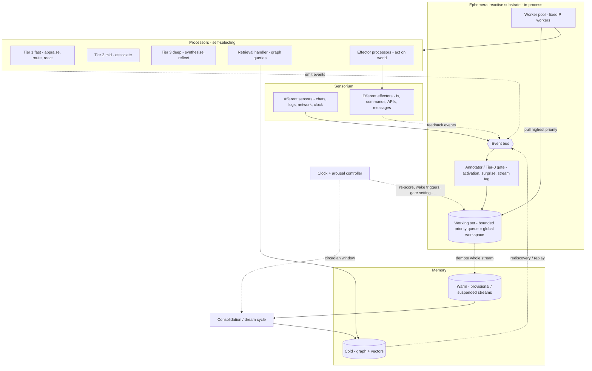

# meno v2 — System Design

*This document turns the logical kernel (`redesign.md`) into concrete components:
their responsibilities, interfaces, and how an event moves through them. It is
subordinate to `redesign.md` — where the two ever disagree, the kernel wins and
this document is wrong. It deliberately stops short of the items the kernel marks
deferred (the sensor catalogue, the event wire-schema, the API) and flags
design-level choices that are still open rather than inventing answers.*

Interfaces below are sketched as language-neutral pseudo-signatures. The host
language/runtime is itself a substrate choice still being earned (see
`redesign.md` → "Not yet decided"); the shapes here assume only an in-process
event loop with a worker pool.

---

## Component map



The rest of this document walks each box: the **event** that flows between them,
the **ephemeral substrate** (bus, annotator, working set, worker pool), the
**processors** that consume, the **streams** they advance, the **memory** they
read and write, the **consolidation** that bridges hot to cold, the **control
plane** (clock + arousal), the **sensorium** adapters, and finally **continuity
across restart** and **safety**.

---

## The event

The event is the one currency; provenance is just a tag. The *wire schema* is
deferred, but the design needs the logical fields:

| field | meaning |
|-------|---------|
| `id` | unique identity |
| `source` | provenance tag — a sensor id, a processor id, or `memory` |
| `kind` | coarse category (afferent sense / self-event / storage / effector-feedback). Not the full catalogue. |
| `stream_id` | the stream it belongs to; null until Tier-1 routing assigns one |
| `parent_id` | lineage, for activation inheritance and back-pressure |
| `payload` | opaque content (schema deferred) |
| `activation` | scalar, **decays over time**; inherited (decayed) from parent |
| `surprise` | unexplained residual, set by the annotator |
| `depth_reached` | highest tier that processed it — a recorded dimension of memory |
| `created_at` | timestamp |
| `status` | `active` / `provisional` / `committed` / `lapsed` |

Two invariants from the kernel:

- **Events are commitments, not computations.** A cheap trigger that ends in
  "ignore" emits nothing. Only a commitment — engaging a model, persisting,
  emitting a derived thought, acting on the world — becomes an event. This keeps
  the stream the record of what was *attended to and done*, and bounds the
  recursion.
- **Activation inheritance is the back-pressure.** A child event's activation is
  a decayed share of its parent's. Cascades attenuate and die unless they keep
  resonating; this is what stops storage-as-trigger from becoming a storm.

---

## The event bus

**Responsibility.** In-process, decoupled publish/subscribe. The single shared
field — the broadcast substrate of the global workspace.

**Interface.**
```
bus.publish(event)
bus.subscribe(predicate, handler)      # content-based, not topic-based
```

**Notes.**
- Subscription is **content-based**: a processor self-selects by a predicate over
  an event's annotations, not by a named topic. The producer never names the
  consumer.
- Publishing is fire-and-forget. No processor calls another; everything goes
  through the bus.
- Matching every event against every predicate is the obvious cost; an index
  over the common annotation thresholds (activation band, kind, stream) keeps it
  cheap. *(Design-open: the matching index structure.)*

---

## The annotator (Tier 0 — the gate, shared)

**Responsibility.** The autonomic gate. Runs on every event, once, cheaply, with
no model. Produces the shared signals that every processor's trigger compares
against — *compute once, threshold many* (DRY).

**Interface.**
```
annotate(event) -> event'   # fills activation, surprise, stream membership
```

**Notes.**
- It is the **hot gate**: activation spreads over the **working set** (the events
  and streams currently active), *not* the persistent graph. Pure in-process
  arithmetic. Full graph spreading activation is a separate, expensive cognitive
  step owned by the retrieval handler.
- `surprise` = the residual the working set cannot explain. Fully-explained
  events (habituation) get near-zero activation and lapse without ever reaching a
  processor.
- This is where the *greedy/loose* threshold from the arousal controller is
  applied: under high load the bar to climb is high (focused); when quiet it
  relaxes (recombinant).

---

## The working set (bounded priority queue = global workspace)

**Responsibility.** The N-deep bounded queue that *is* the attention budget and
the global workspace. Holds hot events, continuously re-scored, evict-lowest.

**Interface.**
```
ws.admit(event)
ws.score(event) -> activation*surprise + pressure(stream) - fatigue(stream)
ws.rescore()                 # called continuously by the clock
ws.claim() -> event          # a worker pulls the top eligible event
ws.demote(stream_id)         # whole-stream eviction → warm (never split)
ws.depth() -> int            # = current load / arousal
```

**Notes.**
- **Score is dynamic**, recomputed continuously — activation decays while waiting,
  `pressure` builds. A deferred-impulse stream therefore *rises* until it reaches
  the front; that ascent is the interoception wake-trigger.
- `fatigue` is lateral inhibition: down-weight events from an over-active stream,
  so no single obsession monopolises the workspace.
- **Eviction is demotion of a whole stream, never an event.** A live stream is
  moved to warm intact (suspended, resumable), never dismembered. Elimination is
  never automatic — only a deliberate cognitive act may release a stream. See
  `redesign.md` → "Demotion, not elimination."
- `depth()` is the load signal the arousal controller reads.

---

## The worker pool (execution, P)

**Responsibility.** A fixed, configurable-size pool of workers — *merely the
execution mechanism.* Each worker pulls the top eligible event, finds the
processors that self-select it, and runs them.

**Interface.**
```
pool = WorkerPool(size = P)
# each worker loop: event = ws.claim(); for p in processors if p.triggers(event): p.run(event)
deep_slots = Semaphore(D)     # D << P : how many deep-tier runs at once
```

**Notes.**
- Workers have **no stream affinity** — any worker advances any stream's next
  event. Streams are logical; workers are interchangeable.
- Pool size `P` bounds concurrent in-flight processing (an execution budget
  complementary to N). A tighter semaphore `D` caps concurrent **deep-tier**
  (expensive model) runs — the real "how many things can I deeply think about at
  once" limit.
- A worker blocked on a model call (I/O) should not hold the pool hostage;
  whether that means async workers or more pool slots than CPUs is an impl
  detail of the chosen runtime.

---

## Processors (O — the typed, self-selecting handlers)

**Responsibility.** The kinds of work. Each processor declares a cheap **trigger**
(self-selection) and an **action**. Most are *multistage*: ordered cheap trigger
steps that gate an expensive model stage, fail-fast.

**Interface.**
```
class Processor:
    tier: int                         # 0..3, for budget/cost
    def triggers(event) -> bool       # cheap predicate over annotations + budget
    def run(event, ctx) -> [events]   # action; may invoke a model; emits commitments
```

**The trigger splits into two conditions that fail differently:**
- **Relevance** (intrinsic): is this worth my kind of work at all? Fail → ignore
  (some other processor, or none).
- **Budget** (extrinsic): is there a free slot in my tier *right now*? Fail →
  **defer, don't discard** — the event/stream waits and builds pressure, and that
  pressure is what later forces a wake. (Deferred-impulse mechanism, for free.)

**The standard processors:**

| processor | tier | trigger (sketch) | action |
|-----------|------|------------------|--------|
| **Appraiser/Router** | 1 | any event surviving the gate with no stream, or needing classification | classify; route to a stream or **spawn** one; emit the reflexive reaction *and* any residual question |
| **Associator** | 2 | mid-activation event within a live stream | connect, reason moderately across the stream; may request retrieval |
| **Synthesiser** | 3 | high-surprise, high-resonance, deep-slot free | synthesise; regenerate reflections; the hard thinking |
| **Retrieval handler** | (cognitive) | an explicit retrieval-request event | spreading activation / similarity **over the graph**; emit results as events |
| **Effector processors** | cognitive | an action-intent event for a controlled sense | act on the world (fs/command/api/message); emit the **feedback** event |

**Notes.**
- **No tier promotes another.** Escalation is each consumer self-selecting
  (Option A). To go deeper, a processor emits an event the deeper processor may
  pick up. True **reflexes bypass the queue** entirely (autonomic, no model).
- The deep model carries two knobs: *which* model and *how much reasoning
  effort*.
- Effector processors are the only path that changes the world, and they are
  **cognitive-tier by rule** — never reflexive.

---

## Streams (the lifecycle of thought)

**Responsibility.** Manage the logical trains of thought: birth, merge, suspend,
resume, end. Streams — not workers — have a lifecycle.

**Interface.**
```
streams.route(event) -> stream_id        # Tier-1: assign existing or spawn
streams.detect_merge() -> [(a,b)]        # convergence detection
streams.merge(a, b) -> stream_id         # combine into one richer stream
streams.suspend(stream_id)               # serialise resumable state → warm
streams.resume(stream_id)                # reconstruct via spreading activation
streams.end(stream_id, mode)             # mode: consolidate | prune(deliberate)
```

**Notes.**
- **Born:** routing spawns a stream when an event fits none.
- **Merge:** two streams whose events strongly co-activate (in the working set or
  via the graph) merge into one — the **insight/aha** moment. *(Design-open: the
  co-activation threshold and how merge rewrites stream membership.)*
- **Suspend/resume:** suspension writes enough state to reconstruct the stream
  later; resume rebuilds it by spreading activation from its entry points over
  the *current* graph (the Phase-5 capability) — so it returns possibly *richer*
  than it left.
- **End:** quiescence → consolidation (default), or deliberate pruning (rare).
  Never automatic mid-thought.
- **Split/branch** is a future possibility, unspecified.

---

## Memory: the three-tier hierarchy

| tier | store | substrate | role |
|------|-------|-----------|------|
| **Hot** | working set | in-process (ephemeral) | the momentary present; the workspace |
| **Warm** | provisional / suspended streams | *placement held* | set aside, resumable; provisional encodings |
| **Cold** | graph + vectors | persistent store | consolidated associative/semantic memory |

- **Hot** is genuinely transient; most events live and die here unwritten.
- **Warm** holds provisional nodes (weak, high-decay) and suspended streams.
  *Whether warm is the tail of the ephemeral layer or weakly-held graph nodes is
  held open* (`redesign.md`).
- **Cold** — the graph — is **off the reactive hot path**, touched only by
  cognitive-tier retrieval and by consolidation. It is the durable record:
  meno's persistence across restarts lives here.

The **episodic event stream** is the raw, time-ordered present; the **graph** is
the consolidated *projection* of its committed subset. Two representations, one
source.

---

## The memory service (graph + vectors)

**Responsibility.** All persistent associative memory and the cognitive-tier
operations over it.

**Interface.**
```
mem.write(node | edge)
mem.spread(entry_points, depth, decay) -> activated_subgraph   # cognitive retrieval
mem.similar(embedding, k) -> nodes                              # rediscovery
mem.decay()                                                     # edges before nodes
mem.store_reflection_cue(entry_points, occasion, tone, gist)
mem.reconstruct(cue) -> reflection                             # regenerate (calls model)
```

**Notes.**
- **Forgetting** decays **edges before nodes**, producing islanded memories
  (available but inaccessible) — recoverable by `similar()` when a new experience
  bridges to them.
- Spreading activation here is the **expensive** graph version, distinct from the
  annotator's hot gate.
- Store choice (SurrealDB vs alternatives) and the **embedding model** are open;
  both are load-bearing — rediscovery *and* reflection reconstruction depend on
  the embeddings.

---

## Reflection subsystem (reconstructive memory)

**Responsibility.** Reflections as cues regenerated at recall — the kernel's one
novelty. Lives partly in the memory service, partly as cognitive-tier processing.

**Flow.**
- **Store** a cue: entry points, occasion, tone, and a lossy **gist** (embedding
  of meaning, not verbatim text). Verbatim is discarded (Fuzzy-Trace).
- **Recall is tiered.** Cue activation cheaply surfaces the **gist** (recognition
  / ghost signal). Only if relevant enough does it escalate to **full
  reconstruction**: spread from entry points over the *current* graph, regenerate
  with a model.
- **Reconsolidate.** Recall rewrites the cue (new entry points, gist blended by a
  **plasticity** dial). Memory drifts toward the most recent reconstruction.
- **Journaling** is the deliberate escape hatch: meno may freeze a reflection
  verbatim as a fixed artifact. Rare, marked.
- The **dream** re-reconstructs reflections with the gate loose, against a graph
  consolidation has reorganised — so reflections *grow* offline.

*(Design-open: the gist's concrete form, and the plasticity blend function.)*

---

## The consolidation (dream) cycle

**Responsibility.** The circadian/low-load pass that bridges hot→cold and keeps
the graph healthy. Runs the gate **loose**.

**Steps (one cycle):**
1. **Fold** the committed subset of recent events into the graph (episodic →
   semantic projection).
2. **Recombine** with the loose gate — promote low-activation items, permit
   connections waking would have discarded (the source of novelty).
3. **Reconsolidate** reflections (re-reconstruct, blend gists).
4. **Error-correct** the cheap tier's hasty encodings (the reason Tier 1 is
   allowed to be wrong).
5. **Forget** — run edge-before-node decay; let islanding happen.
6. **Promote/demote provisional** — provisional nodes that earned reactivation
   become durable; the rest lapse.

**Notes.**
- Triggered by the **circadian** wake condition: a scheduled window, preferably
  when load is low. It is real work, not idleness — REST is a mode.
- It is the only place **elimination** happens, and even then deliberately.

---

## The control plane: clock + arousal controller

**Responsibility.** The autonomic regulation: drive continuous re-scoring, set
the global gate threshold, and fire the three wake triggers.

**Interface.**
```
loop forever (autonomic, cheap):
    ws.rescore(); mem-light maintenance
    load = ws.depth()
    gate_threshold = f(load)                       # high when loaded (greedy), low when quiet (loose)
    if external_event_survived_gate: wake(EXTERO)
    if max_stream_pressure() > P_thresh: wake(INTERO)   # initiative
    if circadian_window_open() and load_low: wake(CIRCADIAN)  # dream
```

**Notes.**
- This loop is the **heartbeat** — always on, no model, cheap.
- `wake(...)` does not "start a tick"; it simply means cognitive-tier processors
  now have something that clears the bar. Initiative is spare capacity acting on
  unclaimed slots.
- The greedy↔loose setting is one scalar derived from load, read by the
  annotator and the consolidation cycle.

---

## Sensorium adapters

**Responsibility.** Bridge the world to the bus (afferent) and the bus to the
world (efferent). The concrete catalogue and schema are deferred; the *pattern*
is fixed.

- **Afferent adapter:** watch a source (chat, log, network, clock) → normalise →
  publish an event. Uncontrolled rate; relies on the gate/back-pressure to triage.
- **Efferent processor:** consume an action-intent event → act (fs/command/api/
  message) → publish a **feedback** event (proprioception). Cognitive-tier;
  world-changing actions are never reflexive.

```
class Sensor:    def poll_or_watch() -> emits events          # afferent
class Effector(Processor):  def run(intent) -> [feedback events]   # efferent, cognitive-tier
```

---

## Continuity across restart

meno *remains* — so a restart is **sleep, not death.** What persists is the
**cold graph** (and, depending on the held warm-tier decision, suspended
streams). The hot working set is ephemeral and starts empty.

**On wake:** reconstruct a working context by spreading activation from recent
and high-salience graph nodes — the Phase-5 reconstruction mechanism applied to
the whole self. meno rebuilds *who it was attending to* rather than restoring a
snapshot, which is exactly the reconstructive thesis at system scope. Pending
deferred impulses (high-pressure suspended streams) should resurface first.

*(Design-open: exactly what, if anything, of warm state is persisted vs.
reconstructed purely from the graph.)*

---

## Safety and control

- **World-changing effects are deliberate, never reflexive** — enforced
  structurally: only cognitive-tier effector processors touch the world; the
  reflex/autonomic layers are sense-and-think only.
- **Scope and permissions** for effectors (which paths, which commands, which
  network destinations) ride with the deferred API — but the structural rule
  above holds regardless.
- **Pruning is deliberate** — the scheduler can only demote/suspend; elimination
  is a considered act in reflection or the dream.

---

## Design-level open questions

Beyond the kernel's own open list (`redesign.md` → "Not yet decided"), the system
design surfaces:

- **Bus matching index** — how predicates are indexed so per-event matching stays
  cheap.
- **Merge detection** — the co-activation threshold and how a merge rewrites
  stream membership.
- **Scoring constants** — decay rates, pressure growth, fatigue strength, the N /
  P / D sizes. All tuning, all empirical.
- **Warm-tier persistence** — what survives restart vs. is reconstructed from the
  graph.
- **Runtime/language** — the host for the in-process loop + worker pool, part of
  the still-open substrate-types decision.
- **Reflection internals** — gist representation and the plasticity blend.

These are the things to settle (mostly empirically, by building the bare loop)
before the sensor catalogue, event schema, and API are pinned down.
